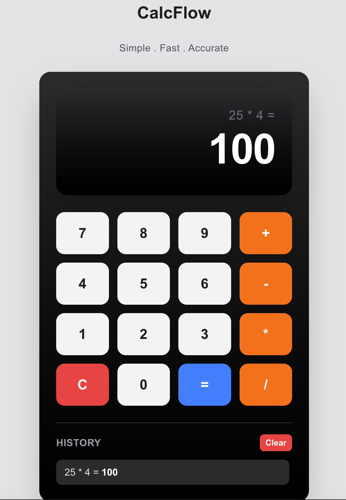
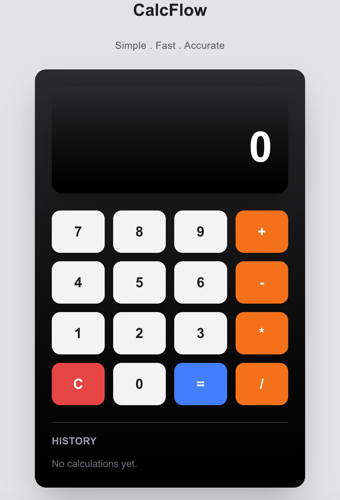

# CalcFlow

A modern full-stack calculator application built with **Next.js, TypeScript, FastAPI, and Python**.

CalcFlow provides a clean and responsive calculator interface with a FastAPI backend, persistent calculation history, and a modular architecture designed with scalability in mind.

## Features

### Calculator

- Addition
- Subtraction
- Multiplication
- Division
- Fast arithmetic calculations through a REST API
- Input validation
- Division by zero protection
- Clean number formatting
- Responsive calculator interface

### Calculation History

- Automatically saves completed calculations
- View previous calculations
- Persistent history storage using JSON
- Clear calculation history
- Scrollable history panel
- Latest calculations displayed first

### User Interface

- Modern responsive design
- Built with reusable React components
- Interactive calculator buttons
- Hover and click animations
- Clean dark calculator display
- Mobile-friendly layout

## Technologies

### Frontend

- Next.js
- React
- TypeScript
- Tailwind CSS

### Backend

- Python
- FastAPI
- Pydantic
- JSON file storage

### Tools

- Git
- GitHub
- VS Code
- REST API
- npm

## Screenshots

### Calculator Interface



### Calculation History


### Empty History State



## Project Structure

```text
python-calculator/

│
├── backend/
│   ├── .env.example
│   ├── main.py
│   ├── calculator.py
│   ├── operations.py
│   ├── history_manager.py
│   ├── history_exporter.py
│   └── utils.py
│
├── frontend/
│   ├── src/
│   │   ├── app/
│   │   ├── components/
│   │   │   └── Calculator/
│   │   │       ├── Calculator.tsx
│   │   │       ├── Display.tsx
│   │   │       ├── Button.tsx
│   │   │       ├── ButtonGrid.tsx
│   │   │       └── History.tsx
│   │   │
│   │   ├── lib/
│   │   │   └── calculatorApi.ts
│   │   │
│   │   └── types/
│   │       └── calculator.ts
│   │
│   └── package.json
│
├── history.json
├── requirements.txt
├── README.md
└── .gitignore
```


## How to Run

### Backend

Copy the example environment file:

```bash
cp backend/.env.example backend/.env
```

Install Python dependencies:

```bash
pip install -r requirements.txt
```

Start FastAPI server:

```bash
uvicorn backend.main:app --reload
```

Backend runs at:

```text
http://127.0.0.1:8000
```

### Frontend

Go to the frontend folder:

```bash
cd frontend
```

Install packages:

```bash
npm install
```

Start Next.js:

```bash
npm run dev
```

Frontend runs at:

```text
http://localhost:3000
```

## Author

Dawit Abraha